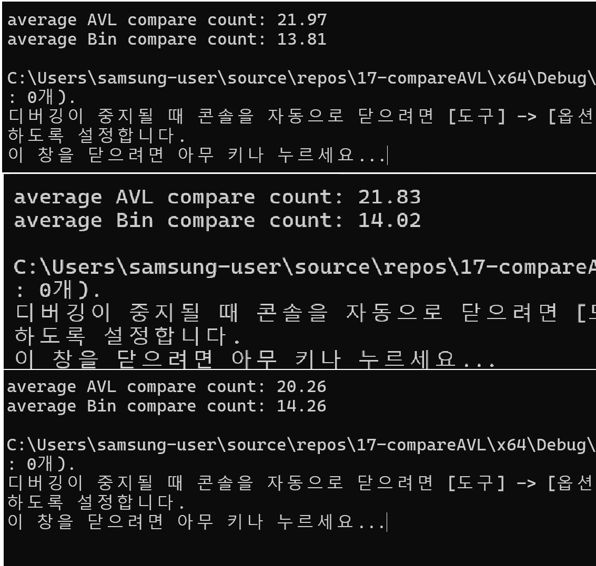

#Compare AVL {Result image}
이진 탐색 트리와 AVL 트리의 비교 횟수는 트리의 균형 상태에 따라 달라진다. 2000번 수행의 평균값 결과를 3번 출력해 보았을 때 두 값의 차이는 별로 없으나 비균형 상태에서 이진 탐색 트리가 AVL트리보다 시간이 더 오래 걸린다. AVL트리에서 수행한 결과값이 이진 탐색 트리로 수행한 결과 값보다 더 적은 것으로 나타난다. 
이처럼 AVL트리는 균형이 잡힌 경우 두 트리 모두 탐색시간이 비슷하게 걸리지만 비균형 상태에서는 AVL 트리가 비교 횟수가 적고 효율적이다.

